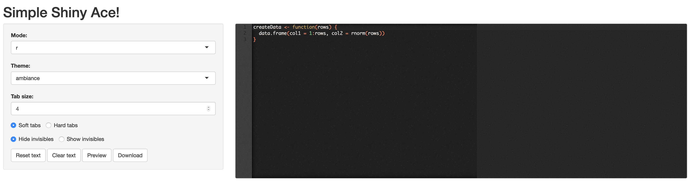
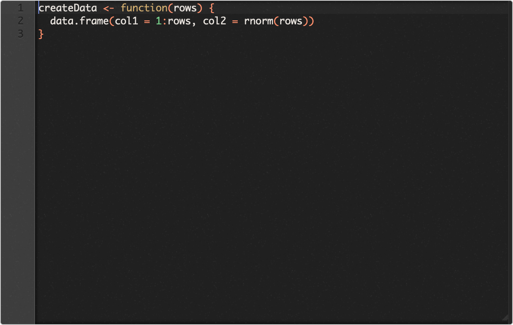

# snapper
snap images of html objects in Shiny apps using canvas2html JQuery library

## Installation

```r
remotes::install_github('yonicd/snapper')
```

## Where it can be useful

  - seleniumless shiny app testing
    - Take a snap of any element in the page using `jQuery` strings
  - offline script image sharing (a la carbon)
    - Implemented in  [carbonace](https://github.com/yonicd/carbonace)

## How to use

  - Load to bindings to the UI using 
    - `snapper::load_snapper()`
  - Add a Preview Button to the UI 
    - e.g.: `snapper::preview_button(ui = '#NAME',previewId = "previewImage")`
  - Add a Div that is connected to Preview Button
    - e.g.: `snapper::snapper_div(id = "previewImage")`
  - Add a Download Button to download directly to a local path
    - e.g.: `snapper::download_button(ui = '#NAME')`

## Verbose Examples

Add preview and download buttons to create `ace` editor images to share online.

<details><summary> script </summary>

```r
library(shiny)
library(shinyAce)
library(shinyjqui)

options(shiny.launch.browser = TRUE)

init <- "createData <- function(rows) {
  data.frame(col1 = 1:rows, col2 = rnorm(rows))
}"

# define server logic required to generate simple ace editor
server <- function(input, output, session) {
  
  observe({
    updateAceEditor(
      session,
      "ace",
      theme = input$theme,
      mode = input$mode,
      tabSize = input$size,
      useSoftTabs = as.logical(input$soft),
      showInvisibles = as.logical(input$invisible)
    )
  })
  
  observeEvent(input$reset, {
    updateAceEditor(session, "ace", value = init)
  })
  
  observeEvent(input$clear, {
    updateAceEditor(session, "ace", value = "")
  })
}

ace <- aceEditor(
  outputId = "ace",
  selectionId = "selection",
  value = init, 
  wordWrap = TRUE,
  placeholder = "Show a placeholder when the editor is empty ...")

# define UI for application that demonstrates a simple Ace editor
ui <- pageWithSidebar(
  headerPanel("Simple Shiny Ace!"),
  sidebarPanel(id = 'side',
               snapper::load_snapper(),
               selectInput("mode", "Mode: ", choices = shinyAce::getAceModes(), selected = "r"),
               selectInput("theme", "Theme: ", choices = shinyAce::getAceThemes(), selected = "ambience"),
               numericInput("size", "Tab size:", 4),
               radioButtons("soft", NULL, c("Soft tabs" = TRUE, "Hard tabs" = FALSE), inline = TRUE),
               radioButtons("invisible", NULL, c("Hide invisibles" = FALSE, "Show invisibles" = TRUE), inline = TRUE),
               actionButton("reset", "Reset text"),
               actionButton("clear", "Clear text"),
               snapper::preview_button(ui = '#ace'),
               snapper::download_button(ui = '#ace')
  ),mainPanel(shinyjqui::jqui_resizable(ace, options = list(aspectRatio = FALSE)), shiny::tags$h3('Preview'), snapper::snapper_div())
)

# Return a Shiny app object
shinyApp(ui = ui, server = server)
```

### App

> Setting ui = 'body' you can take snaps of the app

Default: 



Saved Image:



Different Mode:


Different Theme:


</details>

Add preview button to app with `leaflets` passing arguments to `html2canvas` to render the layers.

<details><summary>script</summary>

```r
library(shiny)
library(leaflet)

shiny::runGadget(
 fluidPage(
    leafletOutput('myMap'),
    snapper::load_snapper(),
    snapper::preview_button(
      ui = '#myMap',
      opts = snapper::config(
        allowTaint = TRUE,
        useCORS = TRUE)
    ),
    snapper::snapper_div()
    ),
  server = function(input, output) {
    map = leaflet() %>% 
      addTiles() %>% 
      setView(-93.65, 42.0285, zoom = 17)
    output$myMap = renderLeaflet(map)
  },
  viewer = shiny::browserViewer()
)
```

</details>
